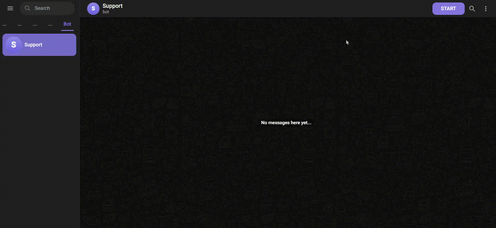
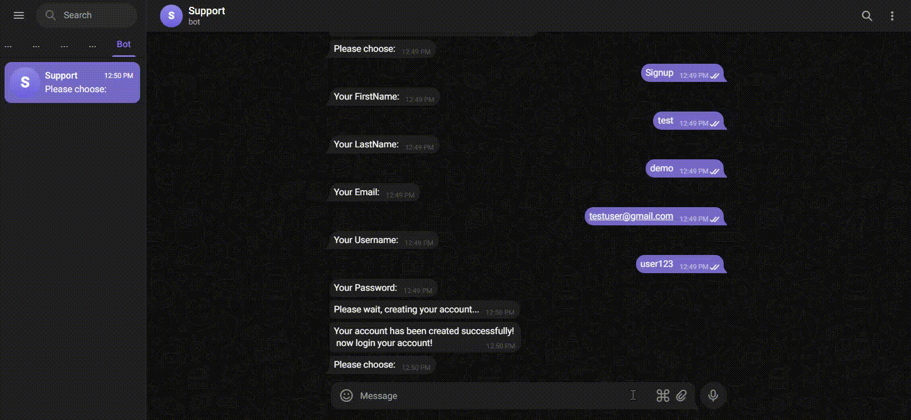
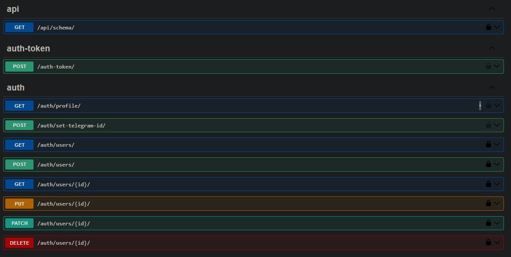
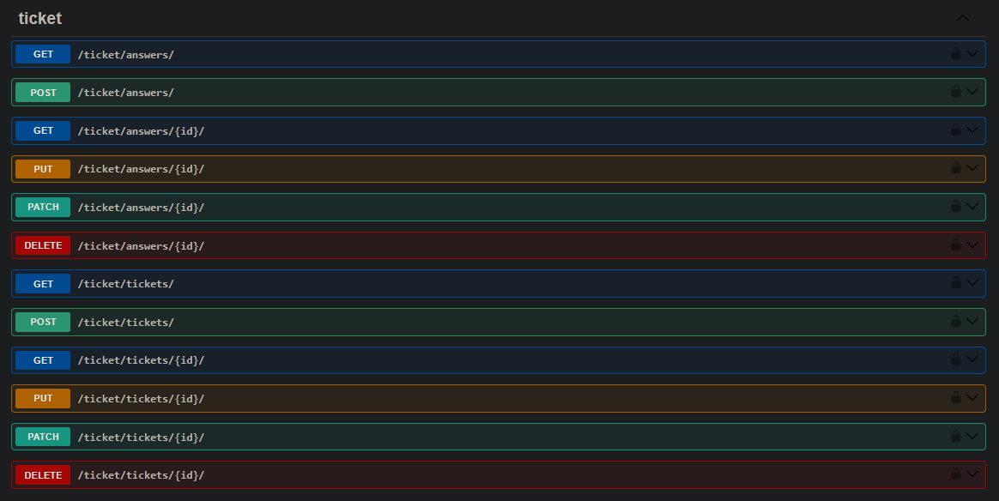
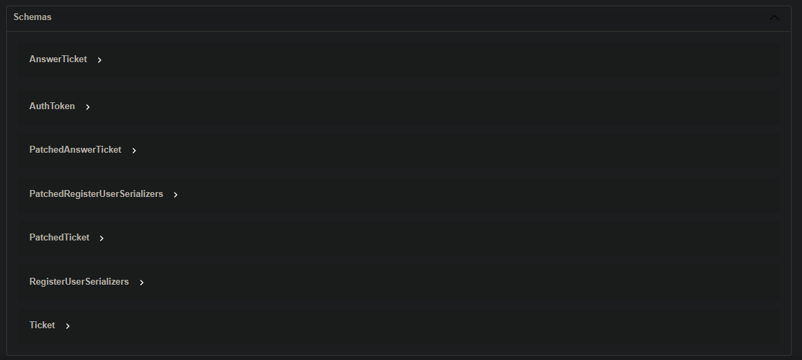

# 🎟️ Ticketing Bot (Django + Telegram)

A simple and practical support ticketing system built with *Django REST Framework* and *Telegram Bot*.  
Users can create tickets via the Telegram bot, and admins can respond either through the Django admin panel or directly in Telegram.

---

## 🚀 Features
- User registration and login (Token Authentication)
- Profile management and Telegram ID binding
- Ticket submission and response
- Admin response via bot or web
- Complete API documentation with *Swagger (drf-spectacular)*
- Modular structure (separate apps: accounts, ticket, bot)
- Logging for debugging and monitoring

---

## 🛠️ Tech Stack
- Python 3.10+
- Django 5+
- Django REST Framework
- drf-spectacular (Swagger / OpenAPI docs)
- python-telegram-bot
- SQLite3 (for development) / PostgreSQL (for production)

---

## ⚡ Installation & Setup

```bash
# 1. Clone the project
git clone https://github.com/Satrap18/Ticketly.git
cd Ticketly
```

# 2. Create virtual environment
```bash
python -m venv venv
source venv/bin/activate   # Linux
venv\Scripts\activate      # Windows
```

# 3. Install dependencies
```bash
pip install -r requirements.txt
```
# 4. Apply migrations
```bash
python manage.py migrate
```
# 5. Create superuser
```bash
python manage.py createsuperuser
```
# 6. Run the project
```bash
python manage.py runserver
```

---
## 🤖 Telegram Bot Setup

Follow these steps to configure your Telegram bot:

1. **Create a new bot** via [BotFather](https://t.me/botfather)  
   - Send `/newbot` and follow instructions.
   - Copy the generated **bot token**.

2. **Save your bot token and admin ID** in a `.env` file at the root of the project:

```env
TOKEN=YOUR_BOT_TOKEN_HERE
ADMIN_ID=YOUR_TELEGRAM_USER_ID
```
---

📖 API Documentation

After running the server, visit:

Swagger UI → http://127.0.0.1:8000/api/docs/

OpenAPI Schema → http://127.0.0.1:8000/api/schema/

---
🎥 Demo  
  
  
  
 


---

📸 Screenshots







---

## 📝 TODO / Roadmap  

- [x] User authentication & registration  
- [x] Ticket creation via Telegram  
- [ ] Write unit and API tests  
- [ ] Add rate limiting to prevent spam  
- [ ] Support ticket categories and priorities  
- [ ] Dockerize the project  
- [ ] Add CI/CD (GitHub Actions)  


---

👤 Author  
[MohammadReza Karimi](https://github.com/Satrap18)


